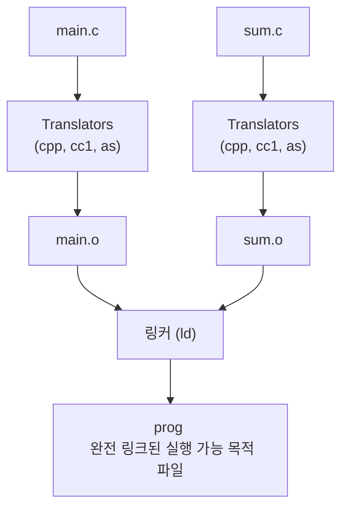

csapp **특히** 중요하다는 (정글 피셜)

7.1, 7.4, 7.9다 +그림 7.15

 

# 7 Linking

링킹은 다양한 코드와 데이터 조각을 결하바고 메모리에 복사해 실행하게 하는 과정이다

컴파일, 로드, 런타임 모두 링킹 가능하다

요즘은 링커라는 프로그램이 보통 링킹을 대신 해준다

링커는 별도 컴파일을 가능케 하고

작게 분해해 각자 수정하고 컴파일 할 수 있게 해준다

거대한 소스 코드 전부 건드릴 필요 없이 말이다

그러나 링킹은 보통 링커가 조용히 처리한다

그렇기에 입문 과정에서 별로 중요하지 않을 수 있다

 

## 왜 배우나?

그치만 알면 좋다

링커를 알면 큰 프로그램 구축 시에 링커가 어떻게 작동하는지, 프로그래밍시에 발생하는 오류를 알 수 있다

링킹을 알면 스코프, 전역 변수와 지역 변수 등의 차이를 이해하는데 도움을 받을 수 있따

공유라이브러리를 활용하거나 시스템 개념 이해하는데도 도움이 된다

흠...

딱보니 Pintos 다룰 때 중요하게 나올 거 같다...

전부는 아니더라도 개념은 확실히 짚고 넘어가야 겠다...

 

# 7.1 컴파일러 드라이버

대부분의 컴파일 시스템은 필요에 따라 언어 전처리기, 컴파일러, 어셈블러, 링커를 호출하는
**컴파일러 드라이버**를 제공한다고 한다

코드들과 함께 컴파일러 드라이버 흐름 나온다

 

둘 다 전처리기(cpp), 컴파일러(cc1), 어셈블러(as) 로 번역한 뒤 링커 프로그램으로 결합한다는 내용이다

   

# 7.4 재배치 가능 목적 파일

