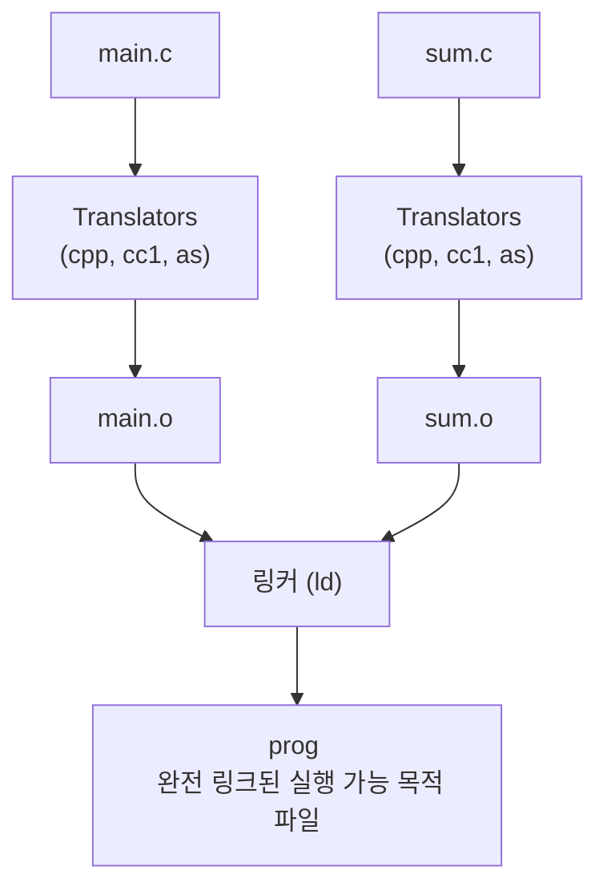

csapp **특히** 중요하다는 (정글 피셜)

7.1, 7.4, 7.9다 +그림 7.15

<br>

# 7 Linking

링킹은 다양한 코드와 데이터 조각을 결합하고 메모리에 복사해 실행하게 하는 과정이다

컴파일, 로드, 런타임 모두 링킹 가능하다

요즘은 링커라는 프로그램이 보통 링킹을 대신 해준다

링커는 별도 컴파일을 가능케 하고

작게 분해해 각자 수정하고 컴파일 할 수 있게 해준다

거대한 소스 코드 전부 건드릴 필요 없이 말이다

그러나 링킹은 보통 링커가 조용히 처리한다

그렇기에 입문 과정에서 별로 중요하지 않을 수 있다

<br>

## 왜 배우나?

그치만 알면 좋다

링커를 알면 큰 프로그램 구축 시에 링커가 어떻게 작동하는지, 프로그래밍시에 발생하는 오류를 알 수 있다

링킹을 알면 스코프, 전역 변수와 지역 변수 등의 차이를 이해하는데 도움을 받을 수 있따

공유라이브러리를 활용하거나 시스템 개념 이해하는데도 도움이 된다

흠...

딱보니 Pintos 다룰 때 중요하게 나올 거 같다...

전부는 아니더라도 개념은 확실히 짚고 넘어가야 겠다...

<br><br>


# 7.1 컴파일러 드라이버

대부분의 컴파일 시스템은 필요에 따라 언어 전처리기, 컴파일러, 어셈블러, 링커를 호출하는
**컴파일러 드라이버**를 제공한다고 한다

코드들과 함께 컴파일러 드라이버 흐름 나온다



<br>

둘 다 전처리기(cpp), 컴파일러(cc1), 어셈블러(as) 로 번역한 뒤 링커 프로그램으로 결합한다는 내용이다

<br><br><br>

# 7.4 재배치 가능 목적 파일

[ELF](),

안타깝게도 그 엘프는 아니다

대신 ELF의 재배치 가능 목적 파일의 형식을 예제 삼아 재배치 가능 목적 파일이 뭔지 알 수 있다


<br>

맨위의 헤더의 경우 파일을 생성한 시스템의 워드 크기, 바이트 순서를 설명하고 링커에게 필요한 정보들이 들어있다

크게 중요하지는 않다만 대강 이런거다

**섹션들(주요 내용)**

- `.text`: 기계어 코드

- `.rodata`: 읽기 전용 데이터(printf 포맷 문자열, switch 점프 테이블 등)

- `.data`: 초기화된 전역/정적 변수

- `.bss`: 미초기화 전역/정적 및 0으로 초기화된 변수(파일 공간 사용 X, 런타임에 0으로 할당)

- `.symtab`: 함수·전역 변수의 심벌 테이블(모든 .o에 존재; 지역 변수 항목 없음)

- `.rel.text`: .text 안에서 외부 함수 호출/전역 참조 등 링크 시 수정할 위치 목록

- `.rel.data:` 주소 값을 초기값으로 갖는 전역 변수 등, 데이터 관련 재배치 정보

- `.debug` / `.line`: -g로 빌드시만 포함(디버깅 심벌·소스 줄 매핑)

- .`strtab`: 심벌/섹션 이름용 문자열 테이블(널 종료 문자열들의 모음)

<br>

재배치 가능 목적 파일(보통 .o)은 링크 전에 주소가 확정되지 않은 코드·데이터 묶음이라 할 수 있다

<br><br><br>

# 7.9 실행 가능한 목적 파일 적재

- 실행 가능한 목적 파일 **prog**를 실행 시

- 로더(메모리 상주 운영체제 코드)를 호출

- 로더는 실행 가능한 목적 파일의 코드와 데이터를 메모리에 복사한다

- 그 다음, 첫 번쨰 명령 (엔트리 포인트)로 점프하여 프로그램 실행

> 이 과정을 **적재(loading)** 라고 한다

<br><br>

## 흐름

1. **실행 요청**: 셸에서 `./prog` 입력(또는 `execve` 호출)

2. **로더 동작**: 디스크의 실행 파일을 읽고, **프로그램 헤더 테이블(PHT)** 를 따라 필요한 덩어리들을 **코드/데이터 세그먼트**로 복사·매핑

3. **점프**: 프로그램의 **엔트리 포인트(항상 `_start`)** 로 제어를 넘김

4. **초기화/호출**: `_start`(crt1.o)이 `__libc_start_main`**(libc.so)** 을 호출 → 실행 환경 초기화 → 사용자 `main` 호출 → 반환값 처리 후 필요시 커널로 복귀

<br>
<br>

런타임 메모리 그림  ↓

<br>


```pgsql
                                                               ↑ 사용자 코드에서
                                                                 보이지 않는 메모리
            ┌────────────────────────────────────────────────┐  
            │                   커널 메모리                   │  
   2^48 − 1 ├────────────────────────────────────────────────┤  
            │              사용자 스택(실행 시 생성)          │← %esp (스택 포인터)
            ├────────────────────────────────────────────────┤
            │                       ↓                        │
            │                                                │
            │                       ↑                        │
            ├────────────────────────────────────────────────┤
            │     공유 라이브러리를 위한 메모리-매핑 영역      │
            ├────────────────────────────────────────────────┤
            │                                                │
            │                                                │
            │                       ↑                        │
            ├────────────────────────────────────────────────┤← brk
            │            런타임 힙(malloc으로 생성)           │
            ├────────────────────────────────────────────────┤   
            │         읽기/쓰기 세그먼트 (.data, .bss)        │   }
            ├────────────────────────────────────────────────┤   } 실행 파일에서 적재됨
            │ 읽기 전용 코드 세그먼트 (.init, .text, .rodata) │   }
   0x400000 ├────────────────────────────────────────────────┤
            │                                                │
          0 └────────────────────────────────────────────────┘
 
```
