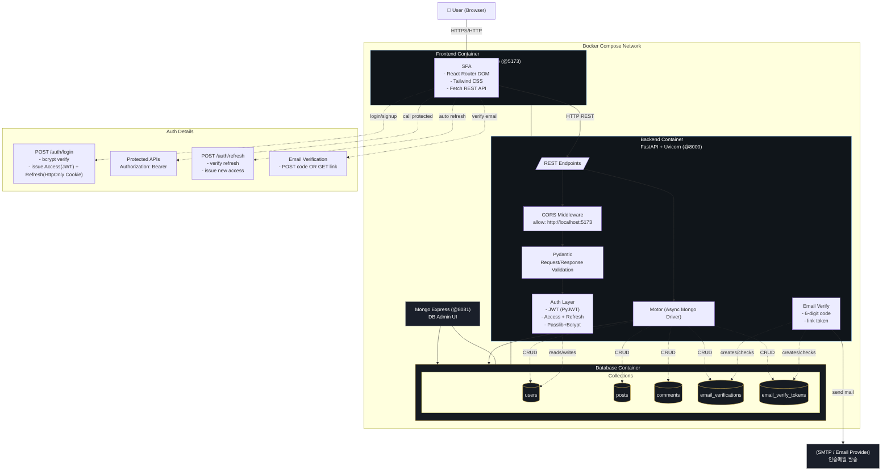

바쁘다 바빠 현대 사회

그러니 간단하게 적고 튀겠다

별건 아니고 웹게시판 만드는게 이번주차 명시적 목표라 관련 내용이다

그냥 정리용 ㅇㅇ

# 정리

## 기술 스택

### Backend

- FastAPI (Python 웹 프레임워크)

- Uvicorn (ASGI 서버)

- Motor (MongoDB 비동기 드라이버)

- Pydantic (데이터 검증)

- PyJWT (JWT 인증)

- Passlib + Bcrypt (비밀번호 해싱)

### Frontend

- React 18

- TypeScript

- Vite (빌드 도구)

- React Router DOM (라우팅)

- Tailwind CSS (스타일링)

### Database

- MongoDB 7

- Mongo Express (DB 관리 UI)

### Infrastructure

- Docker + Docker Compose

## 아키텍처

```txt
Frontend (React/Vite:5173)
    ↓ HTTP
Backend (FastAPI:8000)
    ↓ MongoDB Driver
Database (MongoDB:27017)
```

## 주요 특징

- RESTful API 설계

- JWT 기반 인증 (Access + Refresh Token)

- 이메일 인증 시스템 (6자리 코드 + 링크)

- CORS 설정으로 프론트-백 분리

- Docker 컨테이너 기반 개발 환경

- Hot Reload 지원 (백엔드/프론트엔드 모두)

## 데이터 모델

- users (사용자)

- posts (게시글 + 좋아요)

- comments (댓글)

- email_verifications (이메일 인증 코드)

- email_verify_tokens (이메일 인증 링크)




## 이렇게 쓰는 이유

FastAPI: 빠르다

Uvicorn: 동시성 처리 I/O가 좋다 (Motor와 연계)

Motor: 비동기 Mongo 접근 (Uvicorn 이벤트 루프와 맞물려 지연 최소화)

Pydantic: 엄격한 검증, 직렬화 (프론트와 매핑, API 신뢰성)

PyJWT: 무상태 인증 (세션 공유 불필요)

Passlib + Bcrypt: 안전한 비밀번호 저장 (보안 강화)

React: 대규모 생태 (JWT, 라우팅, 상태관리 패턴)

Vite: 빠른 빌드 속도 (개발 생산성 향상)

Tailwind CSS: 유틸리티 클래스 (빠른 스타일링)

MongoDB: 스키마 유연, 문서지향 (게시판/코멘트에 적합)

Mongo Express: 운영 편의

Docker: 일관된 개발 환경 (종속성 문제 해결)