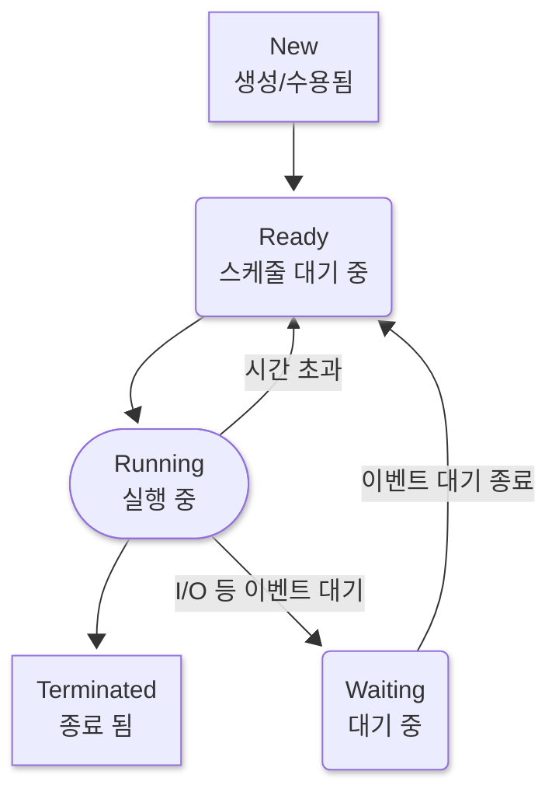

# Process (프로세스)

## 정의와 개념

기본이다

정의는 
**실행중인 프로그램**이다

독립적인 주소 공간(코드/데이터/힙/스택)과 파일 핸들 등 자원의 소유자다

 

다른 프로세스와 **주소 공간 분리**되어있다

자기만의 가상 주소를 갖는다는 뜻으로 다른 프로세스라면 같은 가상 주소더라도 가른 물리 페이지로 연결 될 수 있다

그덕에 프로세스는 다른 프로세스의 메모리를 직접 보진 못한다

 

## PCB (Process Control Block)

커널이 관리하는 프로세스의 메타데이터다

정의는 
운영체제가 **프로세스 하나를 추적/관리하기 위해 커널에 보관하는 상태 기록지**라 할 수 있다

### 내용물들 (대표 항목)

- **ID/상태:** PID, 상태(ready/running/blocked/terminated)

- **스케줄링 정보:** 우선순위, 타임슬라이스 회계, 큐의 링크

- **CPU 문맥:** 레지스터 스냅샷(PC, SP 등) 
*(스위치 시 저장/복원)*

- **메모리 관리: 페이지 테이블 주소**, 코드/데이터/힙/스택 매타, 브레이크

- **열린 자원:** *파일 디스크립터* 테이블, 작업 디렉터리 소켓 등

- **계정/보안:** UID/GID, 권한 마스크

- **프로세스 관계:** 부모/자식 목록, 종료 코드

 

## 수명 주기

화무십일홍이라.

프로세스도 한번 흐드러지게 피었으면 다시 지기 마련이다

- **NEW**

    생성직후다 할당/디스패치 이전의 상태다

- **READY**  

    실행 가능한 상태(주소 공간·자원 준비 완료), ready queue(준비 큐) 대기

- **RUNNING**

    CPU에서 실행 중

- **BLOCKED/WAITENG**

    I/O 대기, **timer sleep** 등 이벤트 기다리는 상태다

- **TERMINATED**

    **종료 완(完)**

  

### 그림으로 보기

 

>**Admit (Admission):** NEW → READY
 
**Dispatch (Dispatcher):** READY → RUNNING
 
**Preemption / Time slice expired:** RUNNING → READY
 
**Block (I/O/event wait):** RUNNING → WAITING
 
**Wakeup (I/O complete/timer):** WAITING → READY
 
**Exit/Abort:** RUNNING → TERMINATED

 

## 컨텍스트 스위치

CPU 하나로 프로그램 하나는 비효율적이기 그지 없다

이를 막기 위한 방법이다

### 정의

CPU 실행 주체를 **하나의 스레드/프로세스에서 다른 스레드/프로세스로 바꾸는 것**

*스레드 전환(thread switch)* 과 **주소 공간이 바뀌는** *프로세스 전환(process switch)* 이 존재한다

 

### 일어나는 경우 (Triggers)

#### 1) 선점 (Preemption)

- **정의:** 
커널이 **강제로** 현재 스레드를 중단시키고 다른 스레드로 바꾸는 것

- **일어나는 경우 (Triggers)**

    1. **타임 슬라이스(Time Slice)[^1] 만료** 
    주기적 **타이머 인터럽트(timer interrupt)** 가 스레드의 실행 시간을 계측하다가 한도를 넘으면 선점

    2. **더 높은 우선순위 스레드가 READY** 진입 
    I/O 완료·`thread_unblock()` 등으로 높은 priority 스레드가 깨어나면 선점

 

#### 2) 블로킹 (Blocking)

- **정의:** 
스레드가 **이벤트를 기다리기 위해 스스로 잠들어(BLOCKED)** CPU를 내놓는 것

- **상태 전이:** 
**RUNNING → BLOCKED** (즉시 컨텍스트 스위치 발생) 
이벤트가 오면 커널이 `thread_unblock()`으로 **BLOCKED → READY**

 

#### 3) 양보 (Yield)

- **정의:** 
현재 스레드가 자발적으로 **CPU를 양보**하고 레디 큐 마지막(or 정책상 위치)으로 들어감

- **사용처:** 
같은 우선순위끼리 **라운드로빈(Round-Robin)**[^2] 공정성을 유지하거나, 잠깐 다른 일을 먼저 돌리고 싶을 때

- **상태 전이:** 
**RUNNING → READY** (컨텍스트 스위치 발생)

#### 4) 인터럽트 반환 (Interrupt Return)

- **정의:** 
인터럽트 처리를 마치고 **원래 실행 맥락으로 돌아가기 직전**의 시점 
이때 “더 급한 스레드가 생겼다”는 신호가 있으면, 
**복귀 대신 스케줄러로 분기**해 컨텍스트 스위치를 수행

- **ISR(인터럽트 서비스 루틴)**[^3] 내부에서 긴 스케줄링·전환 없이, 
**안전한 리턴 지점에서 선점**을 적용하기 위한 표준 패턴

- 단순 원인 이라기보다는 **스위치를 실행하는 타이밍/메커니즘**에 가깝다

   

___

 

[^1]: 스레드 하나가 **연속으로 쓸 수 있는 CPU 시간의 쿼터(quota)**. 단위는 `tick` 
[쿼터(quota)](quota.md)

[^2]: 같은 **우선순위(priority)** 레벨의 READY 스레드들을 **FIFO 큐**로 돌리면서, 각 스레드에 **동일한 타임 슬라이스(Time Slice, Time Quantum)** 만큼 CPU를 주는 정책

[^3]: 하드웨어/타이머 등의 **인터럽트 벡터**가 발생했을 때 **커널이 즉시 실행하는 짧은 처리 루틴**이다 
빨리 반응해야 하기에 코드가 길어지면 안됨 (인터럽트 반환 따로 처리하는 이유) 
그렇기에 **최소 처리만 하고** 무거운 일/스케줄링은 **인터럽트 반환 시점**(yield-on-return 등)으로 **미룬다**